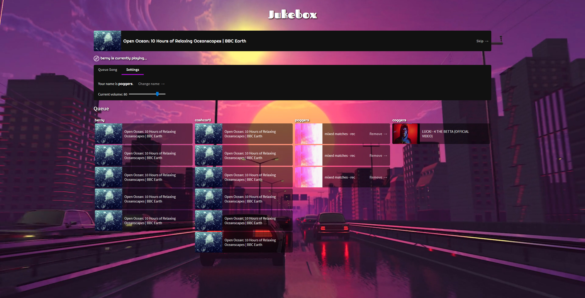

# Jukebox

A web platform to collectively queue songs to play.



Built on top of the old [Bjb1](https://github.com/ocf/BJukebox), the dead [Bjb2](https://github.com/dkess/BJukebox2/blob/master/bjb.py), and [Ryan's](https://github.com/NotRyan) work on a similar [Bjb3](https://github.com/NotRyan/BJukebox3)

Thus, this is aka Bjb 3 (2.0)

## Usage

Song URLS can be Youtube, Soundcloud, or from any website the `youtube-dl` supports.

### Running development locally:

`mpd` should be running locally, and `youtube-dl` should also be installed. Song extraction changes rapidly, so make sure to keep `youtube-dl` updated.

```bash
mpd # Make sure mpd is running and check what port it is on
sudo youtube-dl -U # Update youtube-dl when possible
go run .
```

## Arguments

| Argument  | Description         |
| --------- | ------------------- |
| --host    | Server host ip      |
| --port    | Server port number  |
| --mpdhost | MPD host ip         |
| --mpdport | MPD port number     |

### Improvements over Bjb 2

* Uses mpd idle to watch instead of polling for song changes
* Avoids double requesting youtube-dl 
* Better volume control
* Ability to pause / resume
